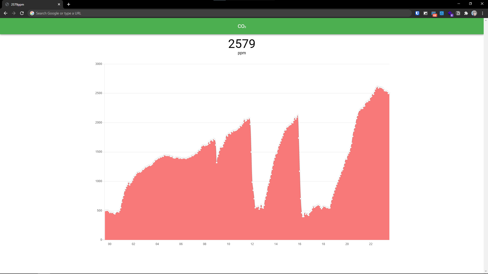

# MH-Z14A-WebUI
NDIRCO2センサー MH-Z14A と Flask を利用した定期的な計測および簡易的な WebUI

#### サンプル

デフォルトで常に 5 分ごとに記録され，WebUI では 10 秒ごとに数値のみを更新，5分おきにグラフを更新します．

## 動作確認済み環境

* NanoPi NEO2
* MH-Z14A

## 準備

NanoPi から MH-Z14A の値を取れるように接続・設定する

## 実行
1. `$ pip install -r requirements.txt`
1. `$ python3 app.py`
1. http://localhost:5000 を開く

## API / Grafana との連携
### JSON形式で取得する
* 今の値: /api/now
* 過去 24 時間: /api/day

### Grafana との連携
Grafana に [marcusolsson-json-datasource](https://github.com/marcusolsson/grafana-json-datasource) 等のJSONを読めるプラグインを導入することで描画させることができます．  
  
marcusolsson-json-datasource の場合
- <サーバーIP>/api/day を指定．
- `$[*].created_at` と `$[*].ppm` を軸に指定．それぞれ Time, Number とする．
- Panel タブの Axes から Left Y の UNit を parts-per-million(ppm) にすることで正しい単位系になる．

